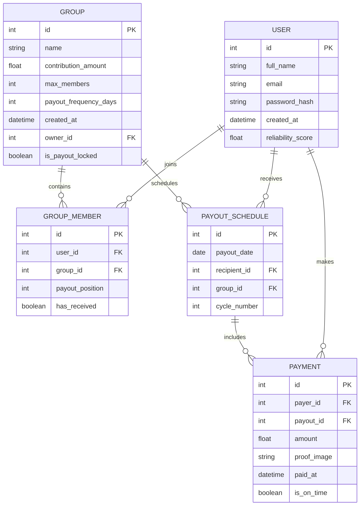
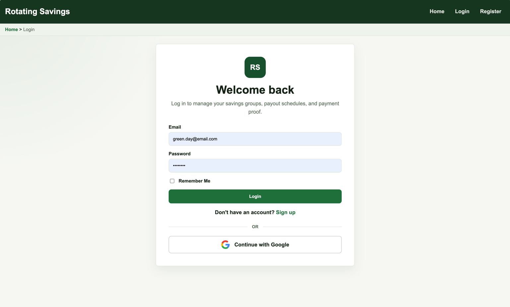
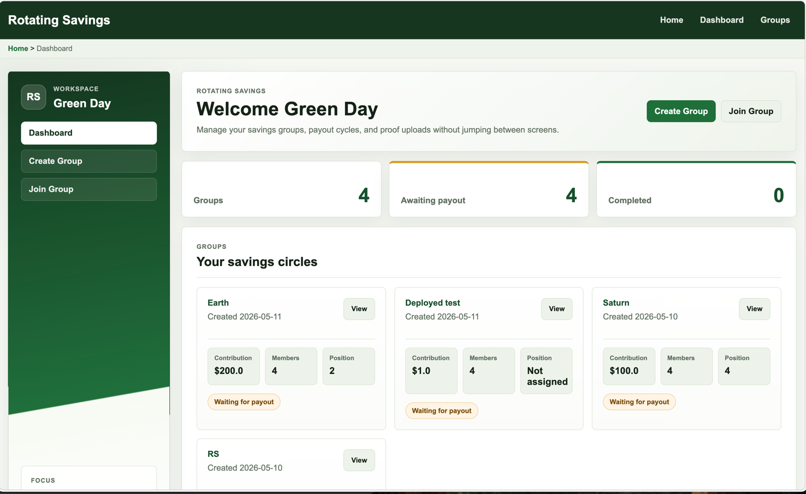

# Rotating Savings Web Application

## Overview

This project is a web-based system for managing rotating savings groups. It replaces informal group chat coordination with a structured platform that handles group creation, payout scheduling, payment tracking, and proof of payment uploads.

The goal is to improve transparency, reduce confusion, and make it easier for members to track responsibilities within a savings group.

---

## Problem Statement

Rotating savings groups are commonly managed through messaging apps. While this works for small groups, it leads to:

- Difficulty tracking payout schedules
- Confusion about who is receiving or paying
- Lost payment proofs in chat history
- Lack of transparency in payment status

This system solves these issues by centralizing all group activity into one platform.

---

## Features

- User registration and login system
- Group creation and membership management
- Randomized payout order generation
- Payout schedule tracking
- Payment status tracking (Paid / Waiting)
- Upload and view proof of payment
- Group dashboard for all members

---

## Tech Stack

**Frontend**
- HTML
- CSS
- JavaScript

**Backend**
- Python
- Flask

**Database**
- SQLite (development)

**Other Tools**
- Flask-Login (authentication)
- Flask-SQLAlchemy (Object Relational Mapping)
- GitHub (version control)

---


---

## Core Workflow

1. Users register and log in
2. Users create or join a group
3. System generates a randomized payout order
4. Each member receives a scheduled payout date
5. Users send payments externally
6. Users upload proof of payment
7. System updates payment status in the dashboard

---

## Key Design Decisions

- Payments are not processed in-app to avoid financial risk
- Proof of payment is required for transparency
- Each payout cycle is pre-generated to avoid disputes
- Simple UI is prioritized for accessibility

---

## Setup Instructions

### 1. Clone the repository
```bash
git clone https://github.com/arantipolo/Rotating_Savings.git
cd Rotating_Savings
```

### Create virtual environment
```bash
python3 -m venv .venv   #Mac
source .venv/bin/activate   
```

### Install dependencies
```bash
pip install -r requirements.txt
```

### Run the application
```bash
python3 run.py  # Mac
python run.py   # Windows
```

### Testing
Basic testing includes:

- User authentication flow
- Group creation and joining
- Payout generation logic
- Payment proof upload
- Dashboard status updates

### Future Improvements
- Messaging system
- Better analytics for group activity
- Role-based permissions (admin/member)
- Optional payment integration (zelle, paypal, etc..)
- Payout position swap
- Migrate it to mobile app
- Start Date selection

### Database Design



### Screenshots
- Login page


- Dashboard

